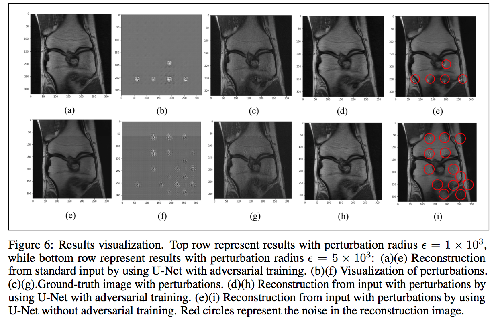

# Robustness of Deep Learning in MRI Reconstruction
The goal is to improve the stability of deep learning model on MRI reconstruction with adversarial training.

* [General Information](#general-information)
* [Dependencies and Installation](#dependencies-and-installation)
* [Files Description](#files-description)
* [Model Training](#model-training)
* [Sample Results](#sample-results)
* [Contact](#contact)

## General Information
Magnetic Resonance Imaging (MRI) is an important medical imaging technique to obtain the anatomy and the physiological processes of the body. MRI examination usually takes a long time, which increases patients stress and diagnostic cost. Decreasing sampling number in Fourier domain could efficiently reduce the acquisition time, hence accelerate the examination process. As the reconstruction process violates Nyquist-Shannon sampling theorem, how to reconstruct high quality image from the subsampled Fourier domain is a difficult problem. The rapid development of deep learning techniques shows the potential to solve this problem. However, researchers found the deep learning techniques have a robustness issue: hardly perceptible perturbation in input data could lead to serious artifacts or enhanced noise, which causes the diagnosis untruthful. A novel adversarial training strategy was used in this projects to improve the stability of the reconstruction model. The result shows this training strategy successfully minimized the effect of perturbations.

## Dependencies and Installation
To run this project, it's required to install fastMRI github packages to perform some pre-processing.
Refer to https://github.com/facebookresearch/fastMRI on "Dependencise and Installation" section about how to setup the environment. After installing the environment, put the Code_adver_train directory to ./FastMRI/fastMRI-master.


## Files Description
final_report.pdf is the final report of the project. FastMriDataModule.py is the data pre-processing code from FastMRI. generator.py is the generator model. unet_model.py is unet model(reconstructor) we used. PerformanceMetrics.py is performance metrics we used. train.py is the main training function we used. train_pert.py is the training for perturbation alone. pytorch_ssim directory is pytorch differntiable SSIM from https://github.com/Po-Hsun-Su/pytorch-ssim.

To see how we visualize the MRI images with and without perturbation, check Visualization.ipynb. To run the notebook, trained model need to be loaded with pytorch.

## Model Training
To train generator and reconstructor and store the models, run 

```bash
python train.py --data_path data_path --batch_size batch_size --learning_rate learning_rate --mask_type mask_type --center_fractions center_fractions --accelerations accelerations --alpha_1 alpha_1 --alpha_2 alpha_2 --epsilon epsilon
```

To run the model in Minnesota Super Institute(MSI), extra environment setting for cuda is needed. For example, in my MSI account, the environment can be set as

```bash
source activate fastmri;
module load cuda cuda-sdk;
module load python3/3.8.3_anaconda2020.07_mamba;
deviceQuery | grep NumDevs;
export LD_LIBRARY_PATH=/home/csci5980/liang664/.conda/envs/fastmri/lib:$LD_LIBRARY_PATH;
```
where the group(csci5980) and user(liang664) directory need to be changed to your own directory name.

## Sample Results


## Contact
The project is completed by Haoxu Huang and Buyun Liang [liang664@umn.edu] (https://www.linkedin.com/in/buyun-liang/) - feel free to contact me if you have any questions!
